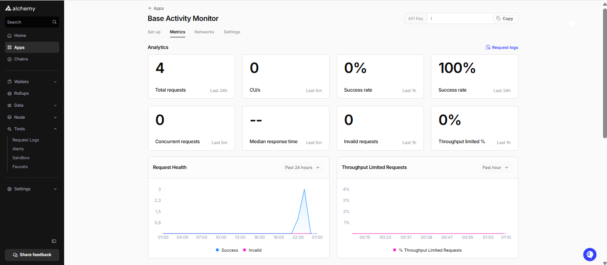

# base-monitor-app

A simple Base Monitor App using Alchemy APIs to fetch and display on-chain activity (ERC-20, ERC-721, and external transfers) on Base.

## Dashboard Screenshot


---

## Getting Started

### 1. Clone this repository  
```bash
git clone https://github.com/solanoas85/base-monitor-app.git
cd base-monitor-app

